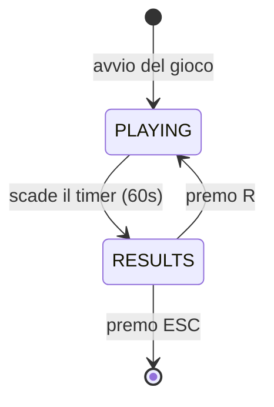

# Architettura — Brain Shift

## Struttura dei moduli

Il progetto è diviso in due parti principali:

### Logica pura (senza pygame)
- `models.py` — descrive com'è fatta una carta da gioco
- `rules.py` — controlla se il numero è pari e se la lettera è una vocale
- `generator.py` — crea carte casuali usando un seed fisso
- `scoring.py` — calcola il punteggio dopo ogni risposta

### Interfaccia grafica (con pygame)
- `config.py` — colori, dimensioni finestra, tempi di gioco
- `ui.py` — disegna tutto quello che vede il giocatore
- `main.py` — avvia il gioco e gestisce il timer e le risposte

## Regola importante
I file di logica pura non importano mai pygame. 
Questo li rende testabili senza aprire una finestra.

## Macchina a stati
Il gioco ha due stati:

- **PLAYING** — il gioco è in corso, il timer scorre, il giocatore risponde
- **RESULTS** — il tempo è scaduto, si mostra il punteggio finale

Si passa da PLAYING a RESULTS quando i 60 secondi finiscono.
Si torna a PLAYING premendo R nella schermata risultati.

## Macchina a stati

### Stato PLAYING
Disegna la carta, il timer e il punteggio. Ascolta i tasti freccia sinistra e destra.
Genera un nuovo trial ad ogni risposta e aggiorna il punteggio.

### Stato RESULTS
Mostra punteggio finale, risposte corrette, errate e accuratezza.
Ascolta il tasto R per ricominciare.

## Flusso di un trial

1. `generate_trial(rng)` crea un nuovo Trial con posizione, lettera e numero casuali
2. `compute_expected_answer` calcola la risposta corretta in base alla posizione
3. `ui.py` disegna la carta sullo schermo
4. Il giocatore preme freccia destra (SÌ) o sinistra (NO)
5. `main.py` confronta la risposta con `expected_answer` e imposta `is_correct`
6. `apply_answer` aggiorna il punteggio
7. La carta diventa verde o rossa per 150ms (feedback visivo)
8. Si genera il trial successivo

## Fading istruzioni

La variabile `correct_count` in `main.py` conta le risposte corrette.
Quando `correct_count >= 10`, `draw_instructions` riceve `show=False`
e smette di disegnare il testo delle regole.